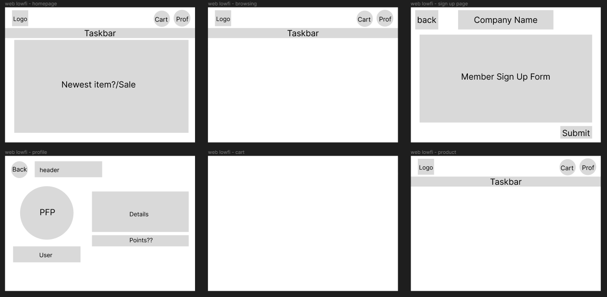

# IP-2024
### Website Links
IP Project Repository 2024: https://github.com/liviniapoo/WookiePlaytimeStore
Website link: https://liviniapoo.github.io/WookiePlaytimeStore/

# Wookie Playtime Store README
### _by Arwen and Livinia_
## What is this for?
Wookie Playtime Store is the website-submission for our IP Project.
It is an ecommerce store that consists of materials from our ID, 3DF, AD and GC modules.

### What is Wookie Playtime Store?
Wookie Playtime Store is a website that allows users to view Wookie Playtime's products and purchase them online.
It is based around 2 characters, Windy the Bunny and Kookie the Sloth, it's targeted more to younger-aged audiences or those who just like cute simple things in general.

The website offers a growing range of products that will hopefully be more catering to a larger range of audiences.

## Design
### Colours and Theme
Wookie Playtime store uses primarily 5 colours: Brown, Pink, Blue, Black and White; all ranging in different shades.
This is for 2 reasons:
1. They follow the colour schemes for the two main characters
2. Using lighter colours for pink, off-white and blue give the website a more cute/friendly style; brown and blue help with visibility

Theme wise, we aimed for a cute, childish theme. Since our website targets younger audiences, it would make sense to first have the visuals be appealing to the said audience. Hence, the mix of the colours and the 2 main fonts give the entire look a more childish, fantasy feel. The different assets and texts in the website and its pages are also neated as much as possible to give the users a more pleasant experience.

### User Stories
1. As a designer, I want my assets to be laid out nicely so the website will be nice to look at.
2. As a kid who likes plushies, I want the website to be eye-catching and pretty so I can stare at it for longer.
3. As an avid shopper, I want the website to be able to offer offers for products so that I feel more compelled to buy these products.

These are examples of user stories we tried to adhere to/satisfy in order to cater to more preferences.

### Assets
Our plush toy assets were modelled by us individually as part of our 3DF deliverable. 
All other product assets (e.g. sticker packs, mugs) were hand drawn by Arwen and uploaded to the website as products

## Features
### Website
The website consists of 6 key pages: Homepage (index), Products (browsing), About, Profile, SignUp/Login and Details.
All pages have the same consistent header and footer. The header acts as a navigation bar across the pages, and the footer contains some essential quicklinks (e.g. Create an Account) and the company's socials.

The website is also responsive to different devices and will rearrange its contents/pages to fit between web view as well as mobile view.

### Homepage
On this page, the contents are minimal and it just showcases the website's newest products: the plush toys.
Other than that the page only has some text and a Shop Now button that directs shoppers to the Products page.

### Products
On this page, the products that the store is offering are displayed in a grid-format with names and prices displayed, and users can either directly add the product into the cart OR click/tap the product itself to be directed to its respective details page to see more about it.

On the top right corner there is a cart icon that upon clicking/pressing, toggles the user's current cart items into view. From there, users can choose the quantity of the products that they want as well as see the total price, and checkout their items.

### Details
Each of the products listed has its respective Details page that shows the product (a 3D view for the plush toys), price, name and a short description.

There is another section below these details that suggests to the user some related products they might want to consider as well.

### About
This page is an informative page that educates the users more about Wookie Playtime Store's origin and how the money earned will be split to charities as well. The members working on the website and their roles are also listed. As professional online stores have contact details, we included some brief contact details such as email and phone number.

### Profile
This page is only accessible if the users have a profile with Wookie Playtime Store. It shows the users information (e.g. name, email) and their current shipping address. There are buttons that give the users the option to update their account information (unfortunately not working). 

The page also shows the users' RECENT order history as well as their points and member status. 
How the point system works is explained on this page as well as membership. 
Users can also use the buttons below to either: navigate to where they can get help regarding the website, and logout of their accounts.

Sadly this page is hardcoded as of now due to lack of time and other coding complications.

### Signup/Login
This page consists of 2 forms that can be toggled back and forth to help users create new accounts, or sign back in to existing accounts. These data are stored in Wookie Playtime's RestDB database. If successful with their login, users will see a small lottie animation as well as a welcome back message before being directed back to the homepage.

## Technologies Used
Content: HTML
Styles: Normalize.css and style.css
Javascript:
1. API and Database Management
2. Toggling certain screens (e.g. the cart)
3. Account and Cookie authentication
4. Lottie Animation
5. Adding and quantifying items in cart
6. Displaying certain products
JSON: Primarily used for storing product data to display
Libraries: JS-Cookie, Lottie Animations, API Handling

## Research
We took a lot of inspiration from different websites. For example,  SHEIN for their point system, ToysRUs for ecommerce. We also planned out roughly how we wanted the website to look with low-fi wireframes in Figma but a large portion of the website did not follow these plannings due to change of ideas along the way and whether its possible for US to code it.

## Tutorials followed/Credits
[Great Day Designs on Youtube](https://www.youtube.com/@greatdaydesigns) for HTML/CSS help
[JS Cart](https://www.youtube.com/watch?v=gXWohFYrI0M) for how to actually add items to cart
[Creating Cookies](https://www.youtube.com/watch?v=KzG6NtO8qdg) for Cookie creation and management
[Deleting Cookies](https://www.youtube.com/watch?v=t3Dm3n2EvoY) for Logout function

**No Codes/styles were directly copied and pasted in this website, instead we followed these guides/tutorials for help**

## Work Allocation
### Arwen: HTML, CSS, JS
### Livinia: CSS, JS, JSON, API
### Note: Commitments on Github are from one laptop since we decided to just have one person commiting to avoid clashes